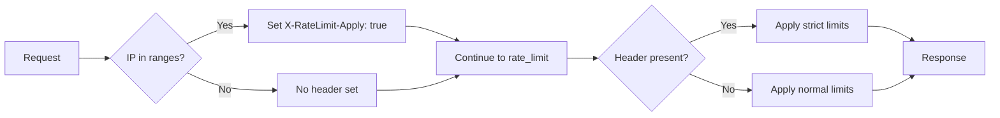

The Rate Limit responder doesn't block requests itself - instead, it marks matching requests with a header that can be used by the [caddy-ratelimit](https://github.com/mholt/caddy-ratelimit) module to apply rate limits.

## Overview

This responder is unique because it **continues the handler chain** rather than terminating the request. It sets an `X-RateLimit-Apply` header on requests from matching IP ranges, which caddy-ratelimit can then use to apply different rate limits to different client groups.

## Requirements

<Warning>
  This responder requires the [caddy-ratelimit](https://github.com/mholt/caddy-ratelimit) module to be installed and configured separately.
</Warning>

## Configuration

<ParamField path="ranges" type="string[]">
  IP ranges to mark for rate limiting. Can be CIDR notations or predefined service keys.
  
  **Default:** `["aws", "azurepubliccloud", "deepseek", "gcloud", "githubcopilot", "openai"]`
</ParamField>

<ParamField path="whitelist" type="string[]">
  Optional list of specific IP addresses to exclude from rate limiting.
  
  **Default:** `[]`
</ParamField>

## Behavior

When a request matches the configured ranges:

<ResponseField name="X-RateLimit-Apply" type="string">
  Set to `"true"` on matching requests
</ResponseField>

<ResponseField name="Request Flow" type="string">
  Continues to next handler in chain (does not terminate)
</ResponseField>

## Examples

<CodeGroup>

```caddyfile Caddyfile - Basic Setup
{
    order rate_limit after basic_auth
}

:80 {
    defender ratelimit {
        ranges openai aws deepseek
    }
    
    rate_limit {
        zone ai_scrapers {
            match {
                header X-RateLimit-Apply true
            }
            key {remote_host}
            events 10
            window 1m
        }
    }
    
    respond "Content"
}
```

```caddyfile Caddyfile - Multiple Rate Limits
example.com {
    # Mark cloud provider IPs
    defender ratelimit {
        ranges aws gcloud azure
    }
    
    # Strict rate limit for marked requests
    rate_limit {
        zone cloud_providers {
            match {
                header X-RateLimit-Apply true
            }
            key {remote_host}
            events 5
            window 1m
        }
    }
    
    # Normal rate limit for everyone else
    rate_limit {
        zone general {
            key {remote_host}
            events 100
            window 1m
        }
    }
    
    reverse_proxy localhost:3000
}
```

```caddyfile Caddyfile - Path-Specific
api.example.com {
    defender ratelimit {
        ranges private
    }
    
    rate_limit {
        zone api_endpoints {
            match {
                path /api/*
                header X-RateLimit-Apply true
            }
            key {http.request.uri.path}
            events 3
            window 1m
        }
    }
    
    reverse_proxy localhost:3000
}
```

```json JSON Configuration
{
  "handler": "defender",
  "raw_responder": "ratelimit",
  "ranges": ["openai", "aws", "gcloud"]
}
```

</CodeGroup>

## Implementation Details

The Rate Limit responder is implemented in `responders/ratelimit.go:12`:

```go
func (r *RateLimitResponder) ServeHTTP(w http.ResponseWriter, req *http.Request, next caddyhttp.Handler) error {
    req.Header.Set("X-RateLimit-Apply", "true")
    
    // Continue with the handler chain
    return next.ServeHTTP(w, req)
}
```

Unlike other responders, this one:
1. Modifies the request by adding a header
2. Calls `next.ServeHTTP()` to continue the handler chain
3. Does not terminate the request

## How It Works



## caddy-ratelimit Integration

The caddy-ratelimit module checks for the header:

```caddyfile
rate_limit {
    zone marked_requests {
        match {
            header X-RateLimit-Apply true
        }
        key {remote_host}
        events 10
        window 1m
    }
}
```

### Rate Limit Parameters

- **events** - Number of requests allowed
- **window** - Time window for the limit (e.g., `1m`, `1h`)
- **key** - What to rate limit by (IP, path, header, etc.)

## Use Cases

### Tiered Rate Limiting
Apply different limits to different client groups:

```caddyfile
defender ratelimit {
    ranges aws gcloud azure
}

rate_limit {
    # Strict limit for cloud providers
    zone cloud {
        match header X-RateLimit-Apply true
        key {remote_host}
        events 5
        window 1m
    }
    
    # Generous limit for others
    zone general {
        key {remote_host}
        events 100
        window 1m
    }
}
```

### API Endpoint Protection
Rate limit API endpoints from AI scrapers:

```caddyfile
defender ratelimit {
    ranges openai deepseek
}

rate_limit {
    zone api {
        match {
            path /api/*
            header X-RateLimit-Apply true
        }
        key {remote_host}
        events 2
        window 1m
    }
}
```

### Cost Control
Limit expensive operations for suspected scrapers:

```caddyfile
defender ratelimit {
    ranges scrapers bots
}

rate_limit {
    zone expensive {
        match {
            path /search*
            header X-RateLimit-Apply true
        }
        key {remote_host}
        events 1
        window 5m
    }
}
```

## Advantages

1. **Flexible** - Doesn't block, just marks requests for rate limiting
2. **Targeted** - Apply different limits to different IP ranges
3. **Graceful** - Allows some access, just rate-limited
4. **Customizable** - Full control over rate limit policies
5. **Non-blocking** - Legitimate traffic not completely blocked

## Comparison with Other Responders

- **vs Block**: Rate Limit allows some requests, Block denies all
- **vs Drop**: Rate Limit continues chain, Drop terminates
- **vs Tarpit**: Rate Limit uses module, Tarpit slows directly
- **vs Custom**: Rate Limit marks requests, Custom returns response

## Best Practices

1. **Order matters** - Place `defender` before `rate_limit` in handler order
2. **Set reasonable limits** - Don't make limits too strict
3. **Monitor logs** - Check what's being rate limited
4. **Use multiple zones** - Different limits for different scenarios
5. **Consider whitelist** - Protect known good IPs from limits

## Handler Order

<Warning>
  The `defender` directive must come **before** `rate_limit` in the handler chain.
</Warning>

```caddyfile
{
    order defender after header
    order rate_limit after defender
}
```

or

```caddyfile
{
    order rate_limit after basic_auth
}
# defender automatically comes before rate_limit
```

## Testing

Test rate limiting:

```bash
# Make multiple requests from blocked IP
for i in {1..20}; do
    curl -H "X-Forwarded-For: 20.202.43.67" http://example.com
    sleep 0.1
done

# Should see 429 Too Many Requests after limit reached
```

Check if header is being set:

```bash
# Use a logging middleware to see headers
curl -v -H "X-Forwarded-For: 20.202.43.67" http://example.com
```

## Troubleshooting

### Rate limiting not working

1. **Check handler order** - Ensure defender comes before rate_limit
2. **Verify header match** - Confirm rate_limit is matching the header
3. **Check IP ranges** - Verify the client IP is in configured ranges
4. **Review rate_limit config** - Ensure caddy-ratelimit is properly configured

### All requests being rate limited

1. **Check ranges** - May be too broad (e.g., using `all`)
2. **Verify whitelist** - Add known good IPs to whitelist
3. **Review rate_limit zones** - May have multiple zones matching

## Advanced Examples

### Combined with Other Responders

```caddyfile
example.com {
    # Block known bad actors completely
    defender block {
        ranges known-bad-ips
    }
    
    # Rate limit cloud providers
    defender ratelimit {
        ranges aws gcloud azure
    }
    
    rate_limit {
        zone cloud {
            match header X-RateLimit-Apply true
            key {remote_host}
            events 10
            window 1m
        }
    }
    
    respond "Content"
}
```

### Custom Rate Limit Response

```caddyfile
rate_limit {
    zone strict {
        match header X-RateLimit-Apply true
        key {remote_host}
        events 5
        window 1m
        
        # Custom response when rate limited
        respond {
            status_code 429
            body "Too Many Requests - Try Again Later"
        }
    }
}
```

## Related Documentation

- [caddy-ratelimit Documentation](https://github.com/mholt/caddy-ratelimit) - Full rate limiting module docs
- [Block Responder](/api/responders/block) - For complete blocking instead
- [Tarpit Responder](/api/responders/tarpit) - For slowing down responses
- [Handler Order](https://caddyserver.com/docs/caddyfile/directives#directive-order) - Caddy handler ordering
